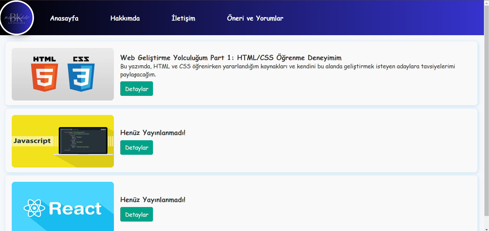
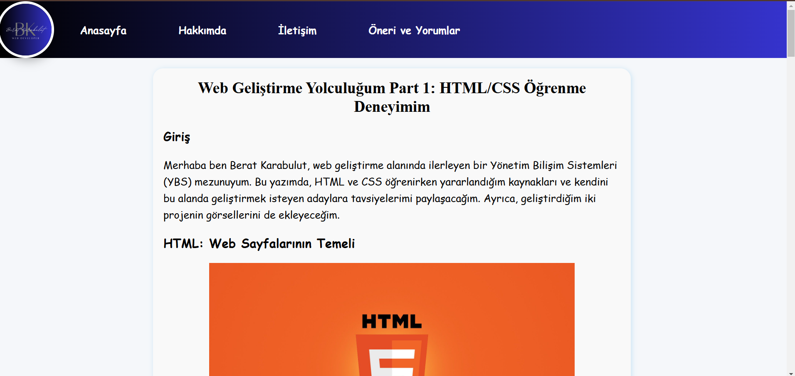
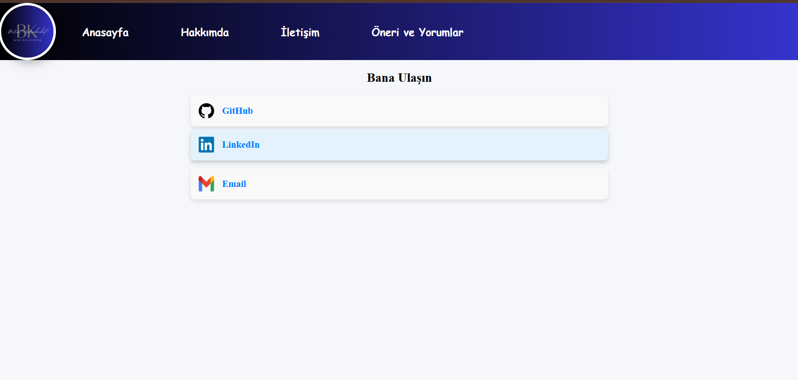
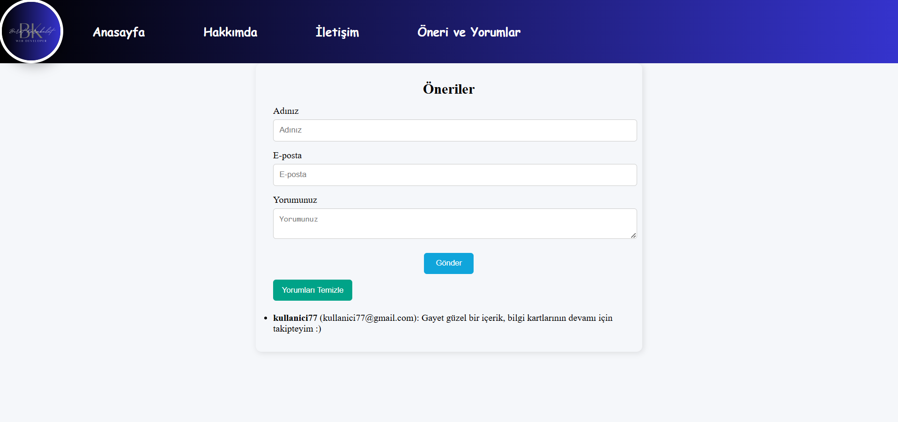

# ✍️ React Blog Website
Bu proje, React kullanılarak geliştirilmiş bir blog uygulamasıdır.

## 🛠️ Kullanılan Teknolojiler
- **React**: Kullanıcı arayüzünü oluşturmak için.
- **React Router**: Sayfa yönlendirmeleri için.
- **Redux Toolkit**: Uygulama durumunun (state) yönetimi ve veri işleme için.  

# 🚀 Özellikler

## 📝 Blog Yazıları  
- Yayınladığım içerikler anasayfada **özet** bilgilerle listelenir.  
- Her yazının detaylı içeriğine **"Detaylar"** butonuyla ulaşabilirsiniz.  
- Modern ve sade bir tasarım ile içeriklerinizi kolayca keşfedin.  

## 👤 Hakkımda Sayfası  
- Blog sahibini tanıyabileceğiniz bir **"Hakkımda"** bölümü.  
- Kişisel bilgiler ve ilgi alanlarına dair kısa bir tanıtım yer alır.  

## 📬 İletişim Sayfası  
- **Sosyal medya** ve diğer iletişim kanallarına hızlı erişim.  
- Kullanıcı dostu bir tasarım ile iletişim kolaylığı sağlanır.  

## 💬 Yorumlar ve Öneriler  
- Blog yazılarına yorum yapabilir ve önerilerinizi paylaşabilirsiniz.  
- Yorumlar anında görüntülenir ve sayfada listelenir.  

## 📸 Ekran Görüntüleri

## 📦 Projeyi Çalıştırma

Projeyi kendi bilgisayarınızda çalıştırmak için aşağıdaki adımları izleyebilirsiniz:

1. Blog-Website dosyasını zipten çıkarın.
2. Terminal veya komut satırında, proje klasörüne gidin ve bağımlılıkları yüklemek için npm install komutunu çalıştırın.
3. Projeyi yerel sunucuda görüntülemek için npm run dev komutunu çalıştırın.
